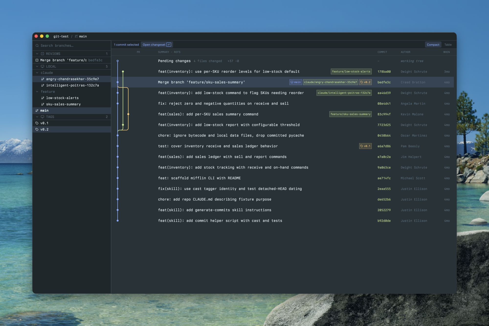
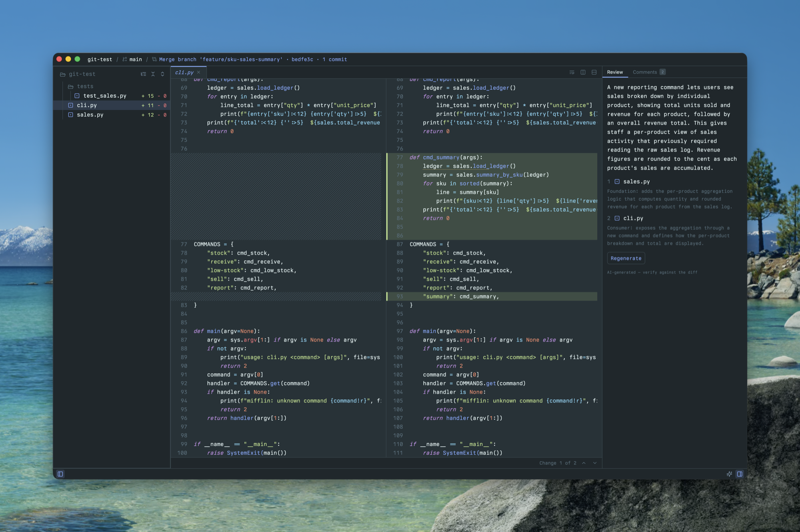

# Greviewer

**A desktop code review tool.** Select any slice of git history (a single commit, a contiguous range, or a comparison between two refs) and review it as single change set in a diff viewer optimized for actually understanding changes.

## Why

Reviewing code is worse than it should be. Every existing option gives you two of the three things you need and withholds the third.

**`git diff` and `git log -p`** let you name any range you want. What they hand back is an undifferentiated stream. The hard part of review was never expressing `main..feature`; it's comprehending thirty files as they scroll by in a unified column, with no way to jump between changes, no way to hold two files side by side, and nowhere to write down what you noticed on line 200 before you reached line 900.

**Forge review UIs** like GitHub, Bitbucket, and GitLab solve the reading surface, then constrain what you're allowed to read. The unit of review is the pull request: whatever it happens to contain, no more and no less. Reviewing the three commits in the middle of a branch, or the work you haven't pushed yet, or a merge you inherited from someone who has since left, means either not doing it or falling back to `git diff`.

**Git GUIs** like Fork, GitKraken, Sourcetree, and Tower put the graph front and center, which is the right way to *find* the commits you care about. But they are built to change history, and the diff pane is where they stop trying: a unified column, no splits, often not even real text selection, and no concept of a review that persists past the moment you click away. Reviewing a branch usually means checking it out and moving to a different tool to review.

**Greviewer takes the range flexibility of `git diff`, the reading surface of a forge review UI, and the local, offline, no-forge-required footing of a Git GUI. Then it adds the thing none of them have: context.** You pick your own change set by clicking the graph. You read it in a side-by-side diff with syntax highlighting, word-level emphasis, real text selection, tabs, and split panes. You get AI change summary and a guide for _how_ to review it effectively. You can leave comments anchored to the lines that prompted them. You can chat with AI to gather more context. All of this is persisted in a named review you can close your laptop on and resume next week.

Greviewer is not a Git client. It never moves `HEAD`, never stages, never commits, and writes nothing into your repository. Your reviews and comments live outside the working tree entirely.

## The commit graph



The graph is where you choose what to review. It renders the checked-out tip alongside every local branch, remote-tracking branch, and tag, newest first, with colored lanes and rounded connectors tracing how the branches actually relate. Ref pills sit inline on the rows they belong to. History loads progressively, so large repositories open immediately rather than after a full walk.

Selection is the point of the screen, and it is direct manipulation rather than syntax. **Click** a commit to review it alone. **Shift-click** a second commit to review the contiguous range between them as a single rollup. **Cmd-click** to stage a directional comparison between two refs, a merge preview, with a swap control to flip the direction when you picked them in the wrong order. Whatever you select, `Enter` opens it as a change set.

Pinned above every commit is the **pending changes** row: your uncommitted working tree, reviewable exactly like any commit. Reviewing your own work before you commit it turns out to be one of the things you reach for most, especially in the AI age.

The branch sidebar keeps a long ref list usable. It groups refs into Reviews, Local, Active PRs, Remote, and Tags; nests `/`-delimited branch names into folders; filters as you type; and gives every branch and folder an eye toggle that hides its refs from the graph, so you can narrow a hundred-branch repository down to the two lanes you actually care about.

## The review workspace



Opening a change set gives you the rollup diff for everything you selected. The file tree on the left lists what changed, marks each entry as added, modified, deleted, or renamed, and pins added and removed line counts to the trailing edge. A toggle expands the tree to show every file in the repository, not just the changed ones, so you can open surrounding context read-only without leaving the review.

The diff itself is the reason this project exists. Modified files render **side by side**; added and deleted files render full width; binary files say so plainly instead of vomiting bytes at you. Changed rows carry red and green tints with accent bars, and within a modified pair the diff highlights the **specific words that changed**, so a one-character fix in a long line is visible at a glance instead of demanding you play spot-the-difference. Syntax highlighting is tree-sitter-backed. Alignment gaps are hatched, so you can see where one side simply has nothing to show.

Text behaves the way text should. There is a real caret, real word and line selection, keyboard motion, select-all, and copy, so you can lift a snippet out of a diff and paste it into a message without re-typing it. A soft-wrap toggle handles long lines. A **change-block navigator** at the bottom reports "Change 1 of 12" and steps through the hunks with `Alt-Cmd-Up` and `Alt-Cmd-Down`, so reading a large file becomes a sequence of decisions rather than a scroll hunt.

Files open in **tabs**, and panes **split**: drag a tab to a pane edge, or press `Cmd-K` with an arrow key. Reading a caller and its callee at the same time, side by side, is among the most useful things a review tool can offer, and it is the thing browser-based review most stubbornly refuses to do.

## Reviews and comments

Select text in a diff and a **Comment** pill appears (or press `Cmd-Shift-C`). The comment anchors to the lines that prompted it, marks them with an underline in the diff, and lands in a Comments tab alongside its file, line range, and excerpt. When you reopen the review later, anchors re-resolve against the current diff, by line position first and then by searching for the quoted text, so a comment survives the code moving underneath it.

Comments live inside a **review**: a named, persistent session you start from the window bar, mark complete when you are done, and reopen when you were wrong about being done. Reviews are stored as JSON in your application-support directory, keyed to the repository path. **Nothing is ever written into the repository itself**, so a review leaves no trace in `git status`, and reviewing someone else's branch cannot dirty their tree or yours.

None of this requires AI, a network, or a forge account.

## AI review guide (optional)

When a change set is large enough that "where do I even start" is the real question, Greviewer can generate a **review guide**: a summary of what the change does, followed by a suggested reading order with a rationale for each file. Foundation first, consumers after, rather than the alphabetical ordering every other tool falls back on.

It works by shelling out to the [Claude Code](https://claude.com/claude-code) CLI on your `PATH`. There is no API key to configure and no telemetry. Greviewer invokes `claude` in a read-only mode, restricted to reading files and running read-only Git commands, with editing tools explicitly denied. Generation is always explicit, meaning you press the button, and it shows live activity with a cancel control.

The output is labeled **"AI-generated — verify against the diff"** wherever it appears, and that label is the contract. The guide tells you where to look. It does not tell you the code is fine.

## Bitbucket pull requests (optional)

If your `origin` is a **Bitbucket Data Center / Server** instance and `BITBUCKET_TOKEN` is set, Greviewer lists open pull requests in the sidebar, marks each PR's source-tip commit in a dedicated column in the graph, and jumps to that commit when you click the PR. It is read-only: a bridge from the forge into local review, not a replacement for it. You cannot approve or merge from Greviewer, and that is deliberate.

The integration stays invisible unless it applies. Bitbucket Cloud (bitbucket.org), GitHub, and GitLab are not supported.

## Requirements

A recent stable Rust toolchain, and macOS. The two optional integrations above additionally need the `claude` CLI on your `PATH` and a `BITBUCKET_TOKEN` environment variable respectively. Without them, those features stay quiet and everything else works.

## Running

```
cargo run
```

Open a repository with `Cmd-O`. Greviewer reopens your most recent repository on launch, so later starts land you back where you left off.

## Packaging (macOS)

`cargo run` launches the bare binary, which shows the generic executable icon in the Dock. To build a real, icon-bearing app bundle:

```
bin/bundle
```

This produces `target/bundle/Greviewer.app`. Open it with `open target/bundle/Greviewer.app`.

## Configuration

Settings and reviews live outside your repository, in the application-support directory:

| Path | Contents |
| --- | --- |
| `~/Library/Application Support/Greviewer/settings.json` | Recent repositories, layout preferences, window placement |
| `~/Library/Application Support/Greviewer/reviews/` | One JSON document per review, including its comments |

There is no preferences UI yet. The AI review guide is disabled by setting `"ai_enabled": false` in `settings.json` by hand.

## Limitations

Greviewer is v0.1 and under active development. The known constraints, stated plainly:

- **macOS-first.** Shortcuts are `Cmd`-based, and `bin/bundle` is Darwin-only.
- **Dark theme only.** There is no light variant and no theme picker.
- **One repository per window.**
- **Pull requests are Bitbucket Server only.** Not bitbucket.org, not GitHub, not GitLab.
- **No preferences UI.** Disabling the AI guide means editing `settings.json`.
- Reviews are keyed to a repository's path, so moving the folder hides its reviews.

## Development

```
bin/check
```

Wraps `cargo fmt --check`, `cargo clippy --all-targets -- -D warnings`, and `cargo test`. It passes before any change is considered done.

Design documentation lives in `docs/`: architecture decisions in [`docs/adr/`](docs/adr/), behavioral contracts in [`docs/specs/`](docs/specs/), and working conventions in [`docs/guides/`](docs/guides/).

## License

MIT. See [`LICENSE`](LICENSE).
